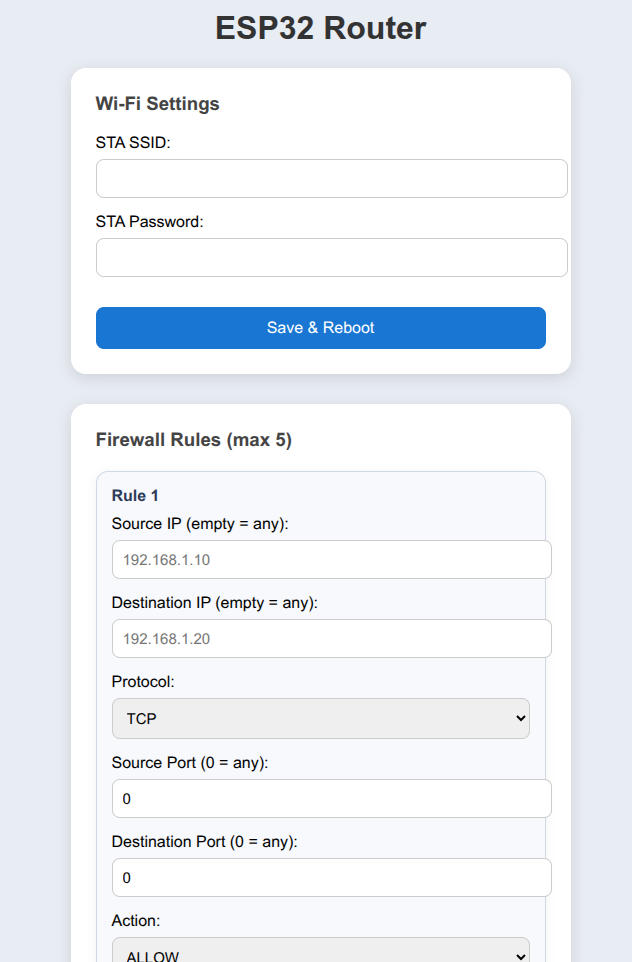

# 🔥 ESP32 WiFi Extender with Firewall, Web UI & OTA Updates

A production-style embedded project built on **ESP-IDF** that implements:

- 📶 WiFi extender mode (STA + softAP)
- 🔥 Custom packet-inspection firewall using **lwIP PCBs**
- 🖥️ Embedded Web UI for configuration (SSID, password, firewall rules)
- 🔄 OTA firmware updates via HTTPS
- 🔐 Secure update server with Python + Flask
- ⚙️ GitHub Actions CI/CD pipeline that auto-builds firmware and deploys it to the update server

This project is designed to mimic real commercial IoT device flows — RF, networking, security, and maintainability.

---

# Features

### WiFi Extender  
The ESP32 connects to an upstream WiFi network and creates a local access point.  
Traffic from clients is routed through the ESP32.

### Packet-Inspection Firewall  
Implements a lightweight firewall using:
- **lwIP raw API**
- **Protocol Control Blocks (PCBs)**
- Custom rule evaluation

Supports up to **three configurable rules** from the UI:
- Block IP
- Block Port
- Block protocol

### Web UI (served directly from the ESP32)
HTML/CSS/JS UI stored embedded in flash.  
Allows live configuration of:
- Network SSID  
- Network password  
- Firewall rules (future)

UI communicates with the ESP32 through a small REST-style HTTP interface.

### OTA Updates (HTTPS)
Includes:
- ESP-IDF OTA implementation
- HTTPS validation
- Firmware fetch via secure connection
- Version checks

### Python OTA Server
Located under `/ota_server`:
- Flask application serving firmware files
- HTTPS certificates (`cert.pem`, `key.pem`)
- Simple API

The server is included in this repo for transparency and demonstration purposes. Same with the keys and certificates.

### CI/CD Pipeline
A GitHub Actions workflow that:
1. Builds the firmware on tag push  
2. Copies the generated `.bin` file  
3. Uploads it to the OTA server folder in the repo  
4. Commits the new firmware + updated `LATEST_VERSION`
